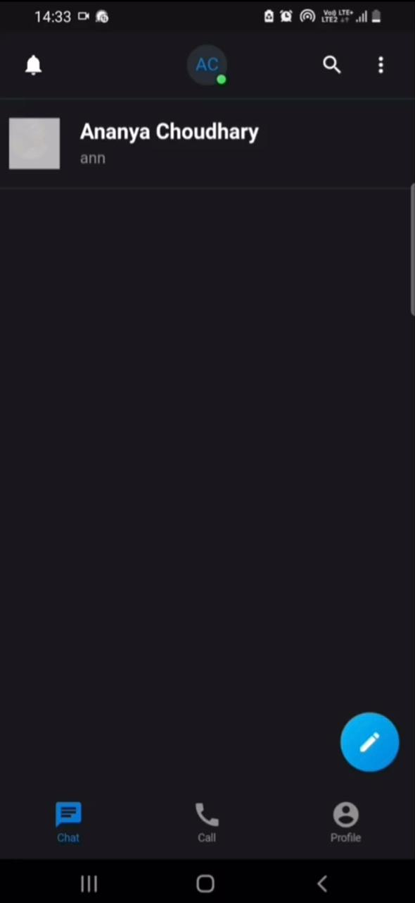
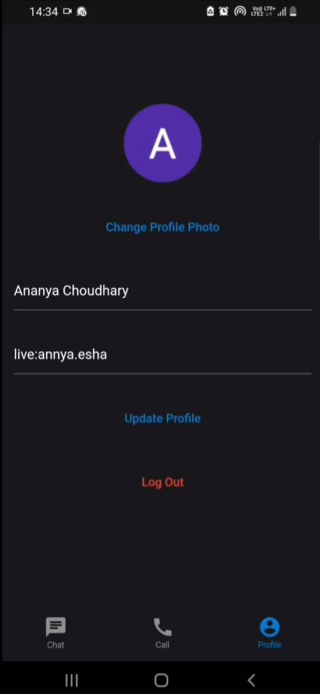
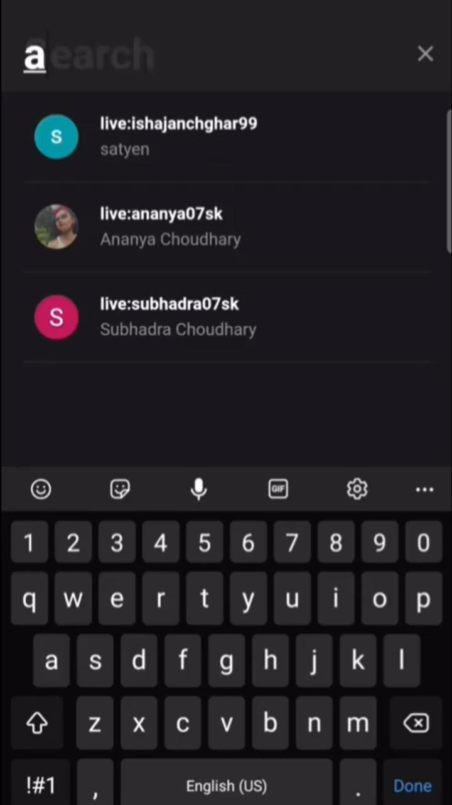
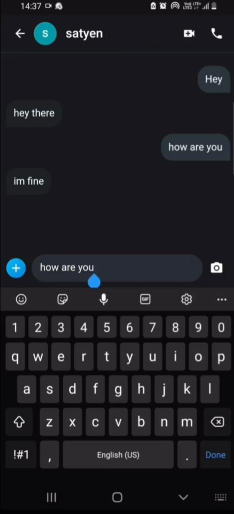
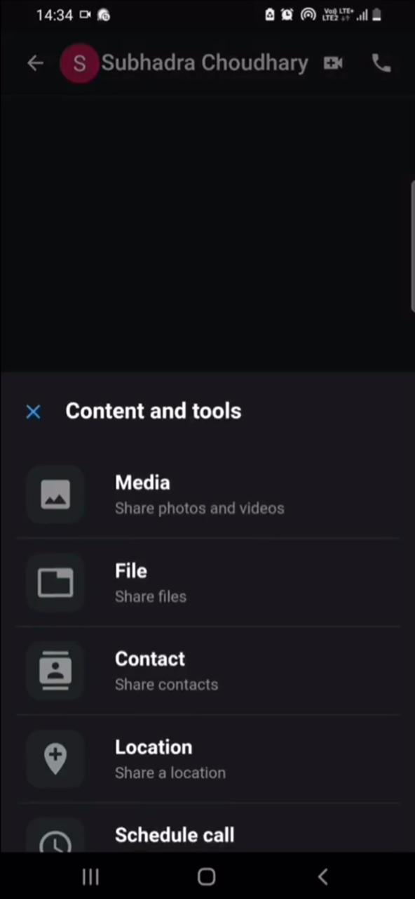
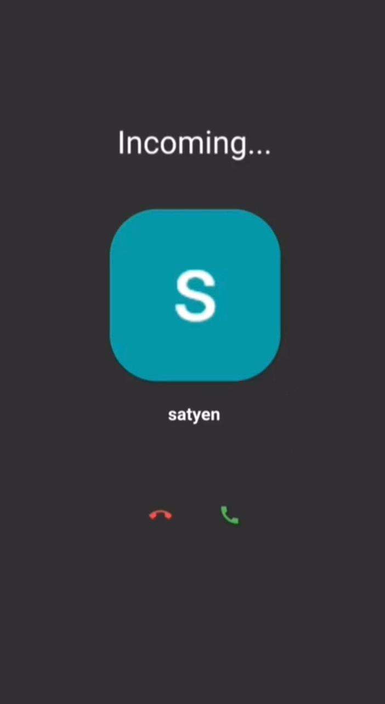

Mobile application where users can search other users, chat and video call in real time . It's build using Flutter and Firebase and it uses the agora rtc enine to support the video calling feature.

## Screenshots:

     

     

     

     

     

     

  
